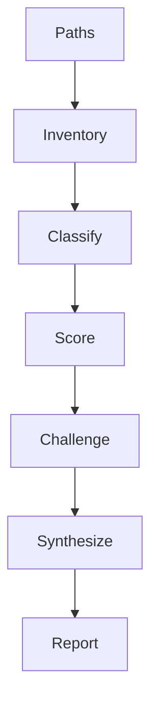

<!--
    Copyright (c) 2026 Michael Vandeberg

    Distributed under the Boost Software License, Version 1.0. (See accompanying
    file LICENSE_1_0.txt or copy at http://www.boost.org/LICENSE_1_0.txt)

    Official repository: https://github.com/cppalliance/corosio
-->

# Documentation Audit

Audits Antora documentation pages **and** public-header docstrings against the five axes
defined in the documentation style guide — **Structure, Accuracy, Wording, Completeness &
Pedagogy, Presentation & Tooling**. Takes one or more `.adoc` pages (**exposition mode**,
Diátaxis-classified) or `include/boost/corosio/**` headers (**reference mode**, Diátaxis mode
fixed to `reference`), and runs a structured analysis pipeline. Sub-agents read all prose or
docstrings and perform all scoring. The main context orchestrates, filters, and renders the
report. Raw page prose and raw docstring text never enter the main context.

**Noise philosophy:** The tool goes out of its way not to find anything. Every finding must
justify its existence against a style-guide rule with a verbatim quoted span. The default
posture is: this page is fine until proven otherwise. A page that scores clean on all axes
is a valid and desirable outcome, not a failure of the tool. Subjective preference is not a
finding.

\newpage



\newpage

---

## Core Rule

Raw page prose or docstring text NEVER enters the main context. All reading and scoring
happen inside sub-agents; the main context receives only structured JSON records. A finding
without a verbatim quoted span is discarded. Non-negotiable.

The five axes are the ONLY axes. The authoritative definitions live in the style guide; the
summaries below are for the sub-agent's convenience. Cite the specific rule (e.g. "C5",
"B1", "D2") in each finding.

- **St — Structure.** Diátaxis mode purity (one mode per page); dependency-correct ordering;
  no duplication of another page; no reproduction of reference signatures (style guide A, B).
- **Ac — Accuracy.** Every claim correct and verifiable against code/reference; no drift.
  (Example *compilation* is a CI gate, not this tool.)
- **Wo — Wording.** Judgment-level prose rules a linter cannot check: undefined terms,
  decorative metaphor/cliché, tone, unnecessary negatives (style guide C5–C7).
- **Co — Completeness & Pedagogy.** Goal-oriented not syntax-first; a concept page shows the
  library's own type running; non-obvious choices state rationale; thread-safety/affinity
  documented (style guide D).
- **Pr — Presentation & Tooling.** Prose links the reference via `cpp:` rather than restating
  it (style guide E1). Nav/ToC/theme/reference-grouping are owned by the build, not here.

**Reference mode remaps every axis to the docstring contract** (fixed Diátaxis mode =
`reference`); see "Reference Mode" below for the concrete per-axis rules.

---

## Step 0 - Inventory

Runs in main context. No LLM. Deterministic.

**Input:** paths — files/directories under `doc/modules/ROOT/pages` (**exposition mode**),
or files/directories under `include/boost/corosio/**` (**reference mode**).

**Actions (exposition mode):** expand directories to `.adoc`; exclude partials (`_*.adoc`),
nav, generated reference. Attach `nav_position` and `declared_mode` (the `:page-mode:`
attribute, or null).

**Actions (reference mode):** expand directories to headers; exclude `detail/`, `impl/`,
`experimental/detail/`, and any public declaration with **no** docstring at all (an
undocumented declaration is the MrDocs no-warnings gate's job, not this tool's — see "Not
this tool's job"). One entry per documented public declaration, keyed by its qualified
`symbol` and the verbatim Doxygen block immediately preceding it.

**Output:** `DiscoveryResult` — `page_entries[]` of `{ path, unit_kind, nav_position,
declared_mode }` for `unit_kind=page`, or `{ path, unit_kind, symbol }` for
`unit_kind=docstring`. Inform the user: "[N] pages / [M] docstrings under audit."

---

## Step 1 - Classify

One sub-agent per page. Determine the page's true Diátaxis mode from content.

**Reference mode (`unit_kind=docstring`) skips this step.** A docstring's Diátaxis mode is
fixed to `reference` by definition (style guide Part A) — set `inferred_mode=reference`,
`declared_mode=reference`, `mode_mismatch=false`, and go straight to Step 2.

**Return:** `ClassifyRecord`

- `path`: string
- `inferred_mode`: one of `tutorial`, `how-to`, `reference`, `explanation`, `mixed`
- `declared_mode`: string or null
- `mode_mismatch`: boolean — `true` only when `declared_mode` is **non-null** and disagrees
  with `inferred_mode`, or `inferred_mode` is `mixed`. **A `null` `declared_mode` is never a
  mismatch** — an undeclared `:page-mode:` is the deterministic lint script's gate (A1; see
  README "Division of labor"), not this tool's judgment call, regardless of how many pages in
  the target corpus currently declare one. (In Capy, where this rule was written, the corpus
  went from 1 of 65 pages declaring `:page-mode:` to 65 of 65 over the course of one plan; the
  rule above did not change and must not be re-tuned to a snapshot count. Corosio's corpus is
  at 48 of 48. A corpus in any of those states defers presence-checking to A1, never to this
  tool's judgment.)
- `topic`: string, **one sentence** — the concept the page teaches
- `approx_word_count`: integer

**Validation:** reject invalid JSON, unknown enum, `topic` > 200 chars. If two pages share a
`topic`, flag a duplication candidate for Step 2.

---

## Step 2 - Score

One sub-agent per page. Score the five axes in a single read.

**Input:** `ClassifyRecord` + any duplication-candidate paths. Sub-agent reads from disk.

**Return:** `PageScore`

- `path`: string
- `axes[]`: exactly five, one per `St`,`Ac`,`Wo`,`Co`,`Pr`, each:
  - `axis`: one of `St`,`Ac`,`Wo`,`Co`,`Pr`
  - `grade`: one of `clean`, `minor`, `major`
  - `findings[]`: **at most 4 per axis**, each:
    - `span`: **verbatim quote** (≤ 200 chars, **except** a `C1`/`C2` sentence-length finding,
      whose `span` is the full offending sentence even past 200 chars — truncating a run-on
      sentence deletes the clause that proves the violation). Required.
    - `rule`: string — the style-guide rule id (e.g. `C5`, `D2`).
    - `problem`: string, **one sentence**.
    - `fix`: string, **one sentence** — the concrete edit.
    - `confidence`: one of `high`, `medium`, `low`.
- `runnable_example_present`: boolean — feeds the `Co` grade for concept pages. **D2 scope:**
  applies hard to tutorial/how-to concept pages (a type must be shown *actually running*, and
  a claimed program output must trace to a compiled `main`/test harness — see the dry-run
  finding below). For `explanation`/design-essay pages, compiled snippets that illustrate
  mechanism (no claimed program output) satisfy the single-source rule without D2's stronger
  "shown running" bar — do not force-fail an essay for lacking one.

**Wording exemption:** text inside an attributed `[quote]` block or a `role=external`/
`role=pseudocode` code block is not the page author's prose — exclude it from `Wo`-axis and
terminology checks (rewriting a citation to match house terminology misquotes the source).

**Presentation scope (`Pr`/E1/B1):** flag a hand-typed **signature** (a restated parameter
list or return type) or a restated concept definition, not every backtick-quoted type name in
casual prose. (Confirmed against the corpus: `cpp:` is established house convention — 51 of
65 pages use it, 555 uses across 93 distinct targets. This is no longer an adoption backlog,
so the noise floor tightens: a bare backtick-quoted reference to a type or member that has a
resolvable `cpp:` target is in scope for a finding, same as a hand-typed signature. Casual
prose that names a concept with no corresponding reference target remains out of scope —
still don't flag every backtick-quoted word.)

**Validation:** reject if any finding lacks a `span`; if a `span` is not verbatim in the
file; if > 4 findings per axis; if the axes are not exactly `St,Ac,Wo,Co,Pr`.

### Reference mode — axis remap (docstrings)

Fixed Diátaxis mode = `reference`. The five axes remap to the docstring contract (align with
the `boost-docs` skill's Doxygen conventions):

- **St** — structural completeness: brief (implicit first sentence) present; no stray
  `\`-commands mixed with `@`-commands; no paragraph stranded inside or after a `@par` block.
  **No section-ordering rule** — retired: the corpus splits 65/26 in favor of `@par` *before*
  the first `@param`/`@tparam`/`@return` (house convention is the "violating" form, 71/29),
  and MrDocs 0.8.0 normalizes section order in the rendered output regardless of source order
  (e.g. `task.hpp`'s `await_resume` writes `@return` before `@par Exception Safety`, but the
  rendered page shows Exception Safety before Return Value) — so there is no stable target to
  score source order against.
- **Ac** — docstring↔code accuracy: every actual parameter has a matching `@param`, same
  name, same order; `@return` present iff the function returns non-`void`; `@throws` matches
  what the code can actually throw (a `noexcept` function carries no `@throws`); a
  `requires`/concept constraint on a template parameter is reflected in prose or `@par
  Requires`.
- **Wo** — same STE-derived prose rules (C1–C10), scoped to the docstring's own sentences
  (excluding `@code`/`@endcode`).
- **Co** — completeness & pedagogy remapped to docstring-contract completeness: `@param`/
  `@return`/`@throws` coverage; thread-safety documented (`@par Thread Safety`) where not
  obviously single-threaded; the template constraint's *purpose* is explained, not only
  stated; `@par Example` present where feasible.
- **Pr** — **MrDocs render check**: valid Doxygen command syntax (no unclosed `@code`, no
  `@param` naming a parameter that does not exist); the brief describes behavior, not
  identity, and does not restate the declaration (style guide B4).

**Known gap — `Ac` has no lettered rule.** Unlike `St`, `Co`, and `Pr` above, reference-mode
`Ac` doesn't map onto any lettered clause in the style guide: Part A/B are written for
exposition-mode structure and briefs, not a per-axis accuracy contract for docstrings. Past
audits have cited `B4` (written for class-brief identity-vs-behavior, not factual accuracy)
to justify a plain factual-error finding under `Ac` — that's a stretch, not a real citation.
Until the style guide settles this (a possible Part B accuracy rule, or an explicit blessing
of the axis id as its own citation — out of scope here, see Task 1b), citing the bare axis id
(`Ac`) as a reference-mode finding's `rule` is acceptable. Do not discard an otherwise-valid
`Ac` finding for lacking a lettered citation the style guide does not currently provide.

A docstring finding's `span` is a verbatim quote from the header (same 200-char rule and the
same C1/C2 exception as exposition mode). Reference-mode findings feed `doc-fix`/`doc-sync`
exactly like exposition findings — the repair still lands in the `.hpp`, never a generated
page (see `doc-fix`/`doc-write`).

---

## Step 3 - Challenge

One adversarial sub-agent per page with any `major` grade. Its job is to REFUTE findings.

**Return:** `ChallengeRecord` — `verdicts[]` of `{ span, survives, reason }`.
**Rule:** default `survives=false` when uncertain. Main drops every non-surviving finding.

---

## Step 4 - Synthesize

Main context, surviving records only. Roll up per-page grades to an axis line
(`St:major Ac:clean Wo:minor Co:major Pr:minor`); rank pages by `3×major + minor`; merge
duplication candidates into one cross-page Structure finding.

**Output — Report** (feeds `doc-fix` directly):

```
## Documentation Audit
| Page / Symbol | St | Ac | Wo | Co | Pr | Mode ok? |
|------|----|----|----|----|----|----------|

### <path> — St:major, Co:major
- **[St · A2]** "<span>" — <problem> -> <fix>   (high)
```

Reference-mode rows use `<path>::<symbol>` (e.g. `include/boost/corosio/tcp_socket.hpp::
connect(endpoint)`) in the Page/Symbol column; `Mode ok?` is always `yes` (mode is fixed).

End with: "[P] pages audited, [D] docstrings audited, [C] clean, [F] findings across the five
axes."

---

## Not this tool's job

Compilation (CI), mechanical prose lint and structural/nav checks (Vale + lint script), and
**rewriting** (`doc-fix` consumes this report). This tool judges only what a linter cannot.
For the reference surface: a public declaration with **no** docstring at all is the MrDocs
no-warnings gate's job (Task 2), not a finding here — this tool judges whether an *existing*
docstring is complete, accurate, and well-worded, not whether one exists.
