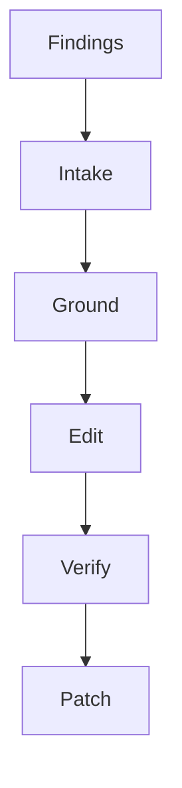

<!--
    Copyright (c) 2026 Michael Vandeberg

    Distributed under the Boost Software License, Version 1.0. (See accompanying
    file LICENSE_1_0.txt or copy at http://www.boost.org/LICENSE_1_0.txt)

    Official repository: https://github.com/cppalliance/corosio
-->

# Documentation Fix

Consumes a findings list (from `doc-audit` or `doc-sync`, or a single page path) and produces
a minimal, grounded patch set. Each edit is tied to one finding and grounded in the real
code/reference. Sub-agents read and edit; the main context orchestrates over records. Raw
code and raw prose never enter the main context.

**Noise philosophy:** The smallest edit that resolves the finding. Preserve the author's
voice and intent. Do not rewrite beyond the finding's span. If resolving a finding requires a
judgment the finding does not authorize (restructuring, changing an argument), escalate
instead of guessing.

\newpage



\newpage

---

## Core Rule

An edit is emitted only when (a) it is tied to a specific finding, (b) it changes only the
finding's span or its minimal enclosing block, and (c) any factual content is grounded in a
verbatim quote of the real code/reference. Code fixes edit the **compiled snippet source**,
not the page. Signature restatements are replaced with `cpp:` links (style guide B). Raw code
and prose never enter the main context.

---

## Step 0 - Intake

Runs in main context. Deterministic.

**Input:** a findings array (the `doc-audit`/`doc-sync` report), or `{ page_path }` (in which
case run `doc-audit` on that page first). `page_path` may be an `.adoc` page **or** a header
(`include/boost/corosio/**`) — a header target runs `doc-audit` reference mode.

**Actions:** group findings by `path` (a header path groups its docstring findings same as a
page groups its prose findings); within a page, order by axis severity (`major` before
`minor`) and by document position. Drop findings without a `span`.

**Output:** `FixQueue` — `pages[]` of `{ path, findings[] }`.

---

## Step 1 - Ground

One sub-agent per page. Reads the page and the real code/reference for each finding's span.

**Return:** `GroundRecord`

- `path`: string
- `items[]`: each `{ finding_ref, current_span, corrected_fact, source_span }` where
  `source_span` is a **verbatim quote** of the code/reference that justifies the correction,
  or `null` if the fix is purely stylistic (wording).

**Validation:** reject any item whose `corrected_fact` is factual but has no `source_span`.

---

## Step 2 - Edit

One sub-agent per finding. Produces the concrete edit.

**Return:** `Edit`

- `finding_ref`: string
- `edit_kind`: one of `prose`, `link` (restated signature → `cpp:`), `snippet` (fix the
  compiled source), `admonition` (move/insert rationale), `docstring` (repair a Doxygen block
  in a header), `escalate`.
- `target_file`: string — the `.adoc` page; the snippet source for `edit_kind=snippet`; or the
  `.hpp` for `edit_kind=docstring`. A reference-mode edit always lands in the header, never a
  generated reference page.
- `before`: **verbatim** current text (≤ 300 chars).
- `after`: replacement text. Conforms to the style guide (C1–C10 for prose; B1/B2 for
  links/snippets) for `target_file=.adoc`, or to the `boost-docs` skill's Doxygen conventions
  (brief/`@param`/`@return`/`@throws`/thread-safety order) for `edit_kind=docstring`.
- `escalation_reason`: string or null — set when the fix needs unauthorized judgment.

**Validation:** reject if `before` is not verbatim in `target_file`; reject if `after`
introduces a factual claim absent from Step 1's `source_span`.

---

## Step 3 - Verify

One adversarial sub-agent per edit. Confirms the edit resolves the finding without collateral.

**Return:** `Verdict` — `{ finding_ref, resolves, introduces_new_claim, style_conformant,
accept }`. `accept=true` requires `resolves && !introduces_new_claim && style_conformant`.
Default to `accept=false` when uncertain.

For `edit_kind=snippet`, `accept` additionally requires the edited source to **compile**. For
`edit_kind=docstring`, `accept` additionally requires the header to still compile and every
`@param` name to match the declaration, in order.

---

## Step 4 - Patch

Main context, accepted edits only. Emit an ordered patch set per file (unified-diff style),
then the escalations as a separate human-review list.

**Output:**

```
## Documentation Fix — patch set
### <path>   (N edits)
- [St · A2] link: "the tcp_socket class" -> cpp:tcp_socket[]
- [Wo · C5] prose: "<before>" -> "<after>"
### <header.hpp>   (N edits)
- [Ac · B4] docstring: "<stale brief>" -> "<brief grounded in the new declaration>"
### Escalations (human judgment required)
- <path>: <finding> — <escalation_reason>
```

End with: "[E] edits across [P] pages, [S] escalations."

---

## Not this tool's job

Finding the problems (`doc-audit`/`doc-sync` do that); deciding structure or argument
(escalated); the mechanical prose lint pass (Vale) runs afterward and should come back clean.
