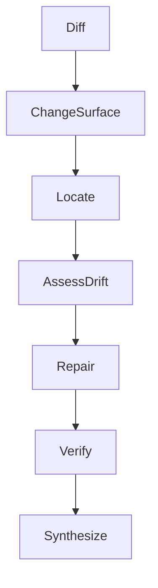

<!--
    Copyright (c) 2026 Michael Vandeberg

    Distributed under the Boost Software License, Version 1.0. (See accompanying
    file LICENSE_1_0.txt or copy at http://www.boost.org/LICENSE_1_0.txt)

    Official repository: https://github.com/cppalliance/corosio
-->

# Documentation Sync

Given a code change (a diff or commit range), finds and repairs the documentation the change
made stale — **including drift that breaks no deterministic rule**. Vale still passes, the
structure is still valid, and any snippet that does not touch the changed API still compiles;
yet a prose description, a rationale, or a reference brief can now be silently wrong. This
tool keys off the *diff*, not off doc-internal rules, so it catches exactly that drift.
Sub-agents read code and docs; the main context orchestrates over records. Raw code and prose
never enter the main context.

**Noise philosophy:** Only the changed surface can cause drift. Start from the diff and reach
outward. A change that touches nothing documented produces zero edits — a valid outcome. No
edit without a changed symbol and a stale doc span.

\newpage



\newpage

---

## Core Rule

An edit is proposed only when tied to a specific changed symbol AND a specific documentation
span, and the correction is verifiable against the **new** code (quote the new declaration or
behavior). No speculative rewrites. Repairs follow the `doc-fix` edit contract (compiled
snippet sources for code; `cpp:` links for signatures; style guide for prose). Raw code and
prose never enter the main context.

---

## Step 0 - Change surface

Runs in main context. No LLM. Deterministic.

**Input:** a diff or commit range (e.g. `git diff A..B` over the public headers).

**Actions:** compute the changed **public** API surface — restrict to declarations under the
public include path; ignore `detail/` and tests.

**Output:** `ChangeSet` — `changes[]` of:
- `symbol`: string (qualified)
- `change_kind`: one of `added`, `removed`, `renamed`, `signature_changed`,
  `semantics_changed` (docstring/behavior changed but signature stable)
- `old_decl`, `new_decl`: strings (verbatim, or null for added/removed)

Inform the user: "[K] public symbols changed."

---

## Step 1 - Locate

One sub-agent per changed symbol. Finds every documentation location that mentions or depends
on it — prose references, reference briefs, example sources, compiled snippets, and prose that
*assumes old behavior* without naming the symbol.

**Drift-hit #1 is mandatory and unconditional.** Before searching anywhere else, the
sub-agent emits one hit for the changed symbol's **co-located docstring** — the Doxygen block
immediately preceding its declaration in the header — as `hit_kind=own_docstring`. This hit
is always produced, whether or not the diff touched the docstring's own text: the docstring
sits beside the symbol the diff just changed, so it is inspected on every run, and Step 2
assesses it against the *new* declaration like any other hit. (This is the reference-mode
entry point for `doc-sync`: reference drift almost always surfaces here first, because a
changed signature or a newly added constraint is exactly the kind of thing an existing brief
or `@param` block silently stops matching.)

**Return:** `DocHits` — `hits[]` of `{ symbol, path, span, hit_kind }` where `hit_kind` is one
of `own_docstring` (the co-located Doxygen block; always hit #1), `signature_mention`,
`prose_reference`, `example_use`, `rationale_dependency`, `xref`; `span` is a **verbatim
quote** from the doc.

---

## Step 2 - Assess drift

One sub-agent per hit. Compares the hit against the `new_decl` / new semantics.

**Return:** `DriftRecord`

- `path`, `symbol`, `span`
- `status`: one of `stale_signature`, `stale_behavior`, `stale_example`, `stale_rationale`,
  `stale_xref`, `still_correct`
- `evidence`: **verbatim quote** of the new declaration/behavior that proves staleness
- `axis`: the style-guide axis the drift violates (usually `Ac`; `stale_rationale` may be
  `Co`)

**Validation:** reject `status != still_correct` without `evidence`. Drop `still_correct`.

---

## Step 3 - Repair

For every stale `DriftRecord`, produce an edit under the **`doc-fix` Step 2 contract** (same
`Edit` record: `edit_kind`, `target_file`, `before`, `after`, grounded in `evidence`). Code
drift fixes the compiled snippet source; signature drift *in exposition prose* becomes a
`cpp:` link; `stale_rationale` is flagged `escalate` (a changed *why* usually needs human
judgment).

A stale `own_docstring` hit is repaired **in the header itself** — `edit_kind=docstring`,
`target_file` is the `.hpp`, `after` conforms to the `boost-docs` skill's Doxygen conventions
(brief/`@param`/`@return`/`@throws`/thread-safety, in that order). The reference edit lands
in the `.hpp`, never a generated page — the generated reference is a build artifact of the
docstring, not a document to edit directly.

**Return:** `Edit[]` (as defined by `doc-fix`).

---

## Step 4 - Verify

One adversarial sub-agent per edit. Confirms the edit matches the **new** code and introduces
no claim the new code does not support. For snippet edits, the source must compile against the
new API. For `edit_kind=docstring`, `accept` additionally requires the header still compiles
and every `@param` name still matches the declaration. Default `accept=false` when uncertain.
(Same `Verdict` record as `doc-fix`.)

---

## Step 5 - Synthesize

Main context, accepted edits only.

**Output:**

```
## Documentation Sync — <A..B>
[K] symbols changed, [H] doc hits, [D] stale, [E] edits, [X] escalations.

### <symbol>  (signature_changed)
- <header.hpp> [Ac] own_docstring stale_signature: "<span>" -> <new docstring>  (accepted)
- <path> [Ac] stale_signature: "<before>" -> cpp:...   (accepted)
- <path> [Co] stale_rationale: "<span>" — ESCALATE: behavior changed, rewrite the "why"
```

The `own_docstring` row is the co-located docstring hit (Step 1) — it always appears first
when the changed symbol's own brief/`@param` block no longer matches the new declaration.

Escalations (renames touching many pages, changed rationale, removed symbols still taught)
are listed for human review, never auto-applied.

---

## Not this tool's job

Judging pages the change did not touch (`doc-audit` does that); applying edits beyond the
changed surface; the mechanical lint/compile gates, which run afterward as the backstop.

## Intended use

Run in the PR that changes a public header, or in a scheduled job over the merge range, so
docs cannot silently drift from code between releases.
