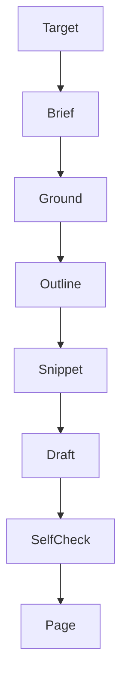

<!--
    Copyright (c) 2026 Michael Vandeberg

    Distributed under the Boost Software License, Version 1.0. (See accompanying
    file LICENSE_1_0.txt or copy at http://www.boost.org/LICENSE_1_0.txt)

    Official repository: https://github.com/cppalliance/corosio
-->

# Documentation Write

Generates a new Antora documentation page (or a section) for a symbol, feature, or topic.
The page is written in the correct Diátaxis mode, conforms to the documentation style guide,
grounds every claim in the real code and reference, and sources every code block from a
compiled snippet. Sub-agents read the code and author the prose; the main context
orchestrates over structured records. Raw code never enters the main context.

**Noise philosophy:** Write the minimum that teaches the reader the concept and lets them
run something. Do not pad. Do not restate the reference. If a fact is not in the code or the
reference, it is not written — it is flagged as a gap for a human.

\newpage

\newpage

---

## Core Rule

Every claim about the API is grounded in a verbatim quote of the real declaration, docstring,
or reference — no invented behavior. Every code block is an `include::example$…[tag=…]` of a
compiled source authored in Step 4, never hand-typed. Every signature mentioned in prose is a
`cpp:` link, never restated (style guide B). Raw code never enters the main context.

---

## Step 0 - Brief

Runs in main context. Deterministic.

**Input:** `{ target, mode, audience, target_file }` — the symbol/feature/topic, the intended
Diátaxis mode (`tutorial`|`how-to`|`reference`|`explanation`), the reader assumed, and an
optional `target_file`.

**Actions:** resolve `target` to its set of public symbols; determine the nav location and
the pages it must cross-link. **If `target_file` names a header** (`include/boost/corosio/**`),
this is a **docstring write**, not a page write: `mode` is forced to `reference`,
`symbols[]` is the single declaration in `target_file`, and `nav_parent`/`related_pages[]` are
`null` (a docstring has no nav entry — Steps 2/4 skip nav-shaped output accordingly).

**Output:** `Brief` — `{ target, mode, audience, symbols[], nav_parent, related_pages[],
target_file }` (`target_file` is `null` for a page write).

---

## Step 1 - Ground

One sub-agent. Reads the real declarations, docstrings, and existing reference for
`symbols[]`. Produces the fact sheet the page may draw on — nothing outside it may be
claimed.

**Return:** `FactSheet`

- `facts[]`: each `{ symbol, kind, signature_ref, behavior, preconditions[], errors[],
  thread_safety, affinity, source_span }` where `source_span` is a **verbatim quote** of the
  declaration/docstring that grounds `behavior`.
- `gaps[]`: strings — facts the reader needs that the code/reference does not state
  (escalated to a human; never invented).

**Validation:** reject any `fact` whose `behavior` is not supported by its `source_span`.

---

## Step 2 - Outline

One sub-agent. Produces a mode-appropriate outline; each section maps to `facts[]`.

**Return:** `Outline`

- `sections[]`: each `{ heading, purpose_one_sentence, fact_ids[], needs_runnable_example }`
- Mode contract: `tutorial`/`how-to` are goal-oriented (open with the use case, not the
  syntax; style guide D1) and every concept section sets `needs_runnable_example=true`;
  `reference` is complete and dry; `explanation` is argued and may carry rationale. **A
  docstring write (`target_file` set) has exactly one section — the declaration itself — and
  always sets `needs_runnable_example` from whether the symbol is example-worthy, not from
  the mode contract above.**

**Validation:** reject if any section maps to no fact; reject a `mixed` outline (one mode
per page, style guide A1).

---

## Step 3 - Snippet

One sub-agent + deterministic build. For each `needs_runnable_example`, first check for an
**existing** compiled snippet already covering the same fact (grep `test/doc/snippets/` and
`example/` for the symbol); reuse its `source_path`/`tag` rather than authoring a duplicate.
Otherwise author a new compiled source file with a tagged region under `example/` or
`test/doc/`, then compile it.

**Return:** `Snippets` — `snippets[]` of `{ section_heading, source_path, tag, compiles }`.

**Validation:** reject any snippet where `compiles=false`. A section that needs an example
but has no compiling snippet blocks the draft.

---

## Step 4 - Draft

One sub-agent. Writes the `.adoc` from the outline, fact sheet, and snippets — **or**, when
`target_file` is set, writes the Doxygen docstring block for the header instead.

**Rules applied while drafting a page (style guide):** one idea per sentence, active voice,
simple tense (C1–C4); terminology table (C.1); `cpp:` links for every symbol (B1, E1); code
via `include::example$…[tag=…]` only (B2); rationale in interleaved admonitions (A3, D3);
`:page-mode:` attribute set (A1).

**Rules applied while drafting a docstring** (`target_file` set; follow the `boost-docs`
skill): implicit one-sentence brief describing behavior, not identity (B4); section order
brief → description → `@param` (one per parameter, in declaration order) → `@return` (omit
for `void`) → `@par` blocks (Thread Safety, Complexity, Example, as applicable) → `@throws` →
`@see`; a `requires`/concept constraint on a template parameter is explained in prose, not
only named; match the local file's comment style (`/** */` vs Asio's `///` + `/** */`) —
never introduce a second convention into a file. **The edit lands in the `.hpp` — a docstring
write never produces or touches a generated reference page.**

**Return:** `Draft` — `{ page_path, adoc_text, nav_entry }` for a page write, or
`{ target_file, symbol, docstring_text }` for a docstring write.

---

## Step 5 - Self-check

One adversarial sub-agent. Verifies the draft before it is emitted.

**Return:** `CheckRecord`

- `claim_checks[]`: each `{ span, grounded_by_fact_id, supported }` — every API claim in the
  prose maps to a fact; `supported=false` marks a hallucination.
- `mode_pure`: boolean; `all_code_is_include`: boolean; `all_signatures_linked`: boolean.
- For a docstring write: `param_names_match`: boolean — every `@param` name matches the
  actual parameter, in order; `brief_describes_behavior`: boolean — the brief is not a
  restated declaration (B4).

**Rule:** if any `supported=false`, or any boolean is false, the draft is returned to Step 4
with the specific failures. Nothing is emitted until all pass.

**Output:** the `.adoc` page, the compiled snippet source(s), the nav entry, and the `gaps[]`
list for human follow-up — or, for a docstring write, the edited `.hpp` and the `gaps[]` list.
Never a generated reference page.

---

## Not this tool's job

Deciding the *information architecture* across many pages (a human, or a structure pass, owns
mode assignment and nav shape); mechanical prose lint (Vale) runs afterward as the backstop.
